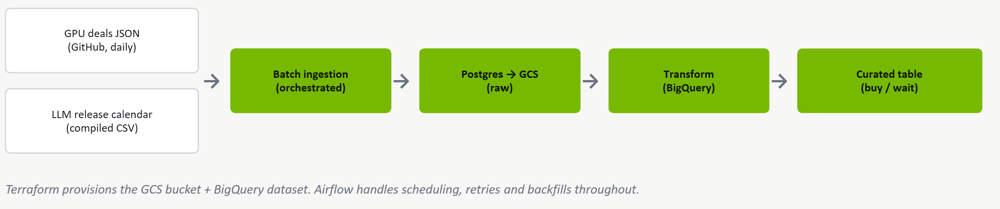

# GPU Affordability
DENG Module Group Project

GPU prices are rising rapidly and few consumers know how long they should wait to buy their preferred hardware. This is only made worse by the release of new LLM Models and news of large companies.

The prognosis made in this project aims for small businesses and individuals to see through the hype and see if their intended GPU's can be bought at reasonable prices, or if waiting is the better option.

For this purpose thie project creates a daily-refreshed table ranking GPU's on the category *buy now* vs. *wait*.


## Data 

A collection of hardware deals beginning last year.

Source: https://github.com/HardwareDealsCo/gpu-deals

The source scraped the data from the website HardwareDeals co, which features hardware components from eBay.

As an additional source data from major AI companies and the release dates of their models shall be gathered manually, or scraped if plausible, to enhance model performance.


## Architecture




## UV Environment

UV is generous on both Windows and Mac devices, which makes it more generous for a group project.

```
uv init

# On every update.
uv sync

# Add a new library to the project.
uv add {library}

# Run python scripts
uv run {script}
```


### Initial Plan
1. Create a first baseline model to check if categorization of models is plausible
2. Build the LLM Release calendar
3. SQL Storage (Schema)
4. Build pipeline
5. Docker setup
6. Compare training model with a true prognosis model for the prices on the next day. Chose if categorization remains the limit with available data.